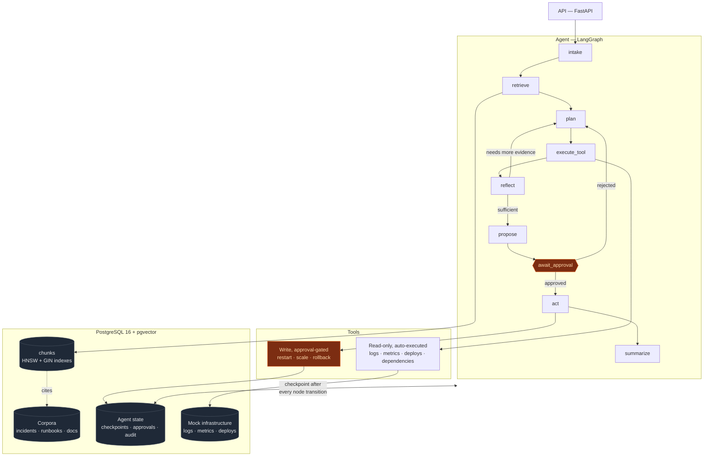

# IncidentIQ

An agentic AI platform for production incident support.

An on-call engineer describes a problem in plain language. The agent retrieves
relevant incident history and runbooks, calls read-only diagnostic tools against
a target system, reasons across several steps, and proposes a remediation.
Anything that would change production state stops and waits for human approval.

What distinguishes it from a demo is the parts demos skip: **investigation state
is persisted and survives process death**, **write actions are gated
structurally rather than by prompt**, and **there is an evaluation harness that
produces real numbers, including bad ones.**

**Status:** Phases 1–3 complete and measured. Phase 4 (approval API) next.
Every number below comes from the harness in this repository and can be
reproduced with the commands given.

---

## Quickstart

Requires Docker and Python 3.11 or newer. No API key needed — the default configuration
uses local embeddings and a local model.

```bash
git clone https://github.com/prachics/incidentiq.git
cd incidentiq

python3 -m venv .venv && source .venv/bin/activate   # Python 3.11+
pip install -e ".[dev]"            # pulls torch for local embeddings; ~2 min
cp .env.example .env

docker compose up -d postgres      # Postgres 16 + pgvector
python scripts/migrate.py          # apply schema
python seeds/generate.py           # 500 incidents, 71 runbooks, 38 service docs, mock infra
python -m incidentiq.rag.indexer   # chunk + embed → 680 searchable chunks
```

That gives a fully seeded, working system. To reproduce the retrieval numbers:

```bash
python -m evals.retrieval_eval --ablation
```

To run the agent you also need a model. The default is local and free:

```bash
brew install ollama && ollama serve &
ollama pull qwen2.5:14b            # ~9GB

python -m evals.run --sample 2 --max-iterations 3   # ~18 min, all 5 scenario kinds
python -m evals.run                                 # the full 100-scenario suite
```

The full suite is a multi-hour job on local inference, so results are written as
each scenario finishes and `--resume` continues an interrupted run:

```bash
./scripts/run_eval.sh              # starts or resumes, whichever is right
python -m evals.run --resume       # the same thing, explicitly
```

An interrupted run loses at most the scenario that was in flight. The progress
file is keyed by provider, model, iteration cap and judge setting, so a resume
cannot silently mix results from two different configurations.

Set `LLM_PROVIDER=anthropic` and `ANTHROPIC_API_KEY` in `.env` to run against
Claude instead; nothing else changes. `python -m evals.compare A.json B.json`
then reports which failure *modes* moved between two runs, not just the headline
number.

Optional services:

```bash
docker compose up -d langfuse      # tracing UI at :3001 (schema ready, not yet instrumented)
docker compose --profile app up -d # API at :8000 — health, readiness, stats, tool catalogue
```

---

## Results

### Retrieval (Phase 2)

| Metric | Result |
|---|---|
| **Recall@5** | **0.800** |
| Hit@5 | 0.917 |
| MRR | 0.917 |
| Median latency | 28.7 ms |

Hybrid retrieval — pgvector cosine similarity plus Postgres full-text search,
fused with weighted reciprocal rank fusion — over `BAAI/bge-small-en-v1.5`
embeddings, 320-token chunks with 64-token overlap, service pre-filter applied
before ranking. Measured across 12 labelled situations.

### Agent (Phase 3)

| Metric | Target | Result |
|---|---|---|
| Task completion | ≥ 90% | **50.0%** |
| Abstention accuracy | — | **100%** |
| Tool execution success | ≥ 95% | 81.2% (32 attempts) |
| Recovery after injected tool failure | — | 50% |
| Median / p95 latency | — | 111.8s / 183.4s |
| Tokens per investigation | — | 16.0k in / 0.7k out |
| Groundedness | ≥ 90% | not yet scored |

| Scenario kind | n | Completion |
|---|---|---|
| Nothing retrievable (must abstain) | 2 | **100%** |
| Injected tool failures | 2 | **100%** |
| Cascading / multi-service | 2 | 50% |
| Single service | 2 | 0% |
| Approval-gated action | 2 | 0% |

**Read these numbers carefully.** They come from a 10-scenario stratified sample
against a local 14-billion-parameter model at a 3-iteration cap — not the full
100-scenario suite at full budget. Task completion is therefore a lower bound.
The comparison against a frontier model is the reason the provider interface
exists and has not been run yet. Groundedness is unscored because a groundedness
figure without a calibration kappa beside it is not interpretable, and that
calibration has not been done.

**Where the failures are is more informative than the score.** Of the five
failures, two were under-commitment rather than wrong answers: the agent
identified the correct failure mode and then declined to commit to it. In one
case it wrote
*"the recommendation-service is experiencing connection pool exhaustion"* — the
correct diagnosis — and abstained because it could not tell whether the cause was
a code defect or a downstream dependency.

That is the direct cost of a deliberate choice. The prompts push hard toward
abstaining rather than fabricating, which is why every abstention scenario
passed. The same bias makes the agent under-commit when evidence is present. A
system tuned the other way would score higher here and would fabricate on the
fifteen scenarios where fabricating is the worst possible behaviour. The
tradeoff is now measured rather than assumed.

Two more were hallucinated tool arguments — a version string that had never been
deployed, and a malformed one — both refused by the tool's own schema validation
before execution, after a human had already approved the action. The fifth named
the right service but not the failure mode.

Note the distinction between the two injected-failure figures: both scenarios in
that category reached a correct conclusion (100% completion), while the recovery
rate is 50% because only one of them had a tool that failed and then succeeded
on a retry.

Full methodology, ablations, and limitations: [`docs/EVALS.md`](docs/EVALS.md).

---

## Architecture



Three properties are worth calling out.

**`plan → execute_tool → reflect` is a loop with a hard cap**, enforced in
control flow rather than in a prompt. A model that always answers "keep going"
still terminates.

**`retrieve` runs after every tool call, not once.** Retrieval on the bare
on-call report scores Recall@5 0.461; on a query enriched with observed error
signatures it scores 0.800. After a tool call the agent has those signatures, so
re-retrieving is worth an iteration.

**The approval gate is structural, in three independent places:** a class
attribute the graph reads to decide whether to interrupt, LangGraph's
`interrupt_before` halting the run with a checkpoint written, and a runtime
check that refuses to execute without an approval row naming that investigation,
that tool, and `decision='approved'`. No phrasing of a prompt makes a write tool
execute.

---

## Seeded data

The corpus is synthetic but not random. Every incident is one of **16 failure
archetypes** applied to one of **33 services** in a hand-authored dependency
graph, which makes it internally consistent in the ways the evaluation depends
on:

- An incident that blames a dependency blames a **real** dependency of that
  service. Verified by query: 90 root causes name another service, and **zero**
  name a service that is not an actual dependency of it.
- Cascading failures follow real edges — `payment-db` degrading surfaces as
  symptoms in `payment-service → checkout-service → api-gateway`.
- The same archetype on a *different* service produces a document that is
  topically similar but factually wrong for a given incident, which is what
  makes retrieval scores meaningful rather than trivial.
- Generation is seeded, so two runs produce identical data and eval numbers stay
  comparable.

**Caveat worth stating plainly:** a synthetic corpus is more internally
consistent than a real company's incident history, so retrieval scores here are
optimistic relative to production. What the numbers legitimately demonstrate is
that the measurement apparatus exists and works.

---

## Engineering findings

Results that were not what was expected going in. Each was found by reading one
failing case end to end, never from an aggregate.

**Hybrid retrieval buys exactly what a metadata filter would have bought.** With
a service pre-filter, hybrid and vector-only tie at Recall@5 0.800. Without it,
vector-only drops to 0.728 while hybrid holds at 0.800. Hybrid's value here is
not beating dense retrieval — it is being insensitive to whether the filter is
available, which is the condition on the first turn, before the agent knows
which service is at fault.

**Hybrid only started helping once the corpus was realistic.** Initially it
scored at or below vector-only everywhere. The cause was a corpus defect, not a
fusion defect: `HikariPool`, `OutOfMemoryError` and `x509` appeared in the logs
and **zero** times in the incident write-ups, so the keyword ranker had no
identifiers to match. A migration added quoted error lines to incidents, as a
real postmortem would. The general lesson: hybrid retrieval beats dense
retrieval when documents contain tokens embeddings cannot represent, and a
corpus of pure prose gains little from it.

**JSON mode guarantees syntax, not schema.** Constrained to valid JSON, the
local model past roughly 3,000 prompt tokens returned `{"incident_updates": ...}`
where `root_cause` was expected. Parsing succeeded, every field read back as
`None`, and the agent emitted an empty proposal *having already reasoned its way
to the correct answer*. Fixed by passing a JSON Schema to the sampler for
grammar-constrained decoding — and then again, because with no `required` array
the grammar still let the model omit `root_cause` entirely.

**Retry classification matters more than retry count.** An unknown service name
was classified as a transient failure, so the retry loop tried identical bad
arguments three times per iteration and burned the entire budget without a
single successful call. Argument errors now break the loop and return a specific
correction — *"Did you mean: checkout-service?"*, via trigram similarity.

**An example value in an error message is a value the model will copy.** A
validator rejected a malformed version with the message *"should look like
'v1.2.3'"*. That message reached the model through its scratchpad, and its next
attempt proposed rolling back to `v1.2.3` — on a service whose deploys were all
`v2.27.x`. Error text that feeds back into an agent's context is part of the
prompt.

**When a capable model fails in a way that looks careless, read the scenario
before believing the score.** Five times an eval expectation was wrong rather
than the agent — including one case where the agent read logs describing two
concurrent incidents and correctly declined to name a single cause, and was
marked down for it. Models do fail carelessly, but a failure that looks *stupid*
is more often a broken expectation than a broken model.

---

## What is built, and what is not

| Phase | Scope | Status |
|---|---|---|
| 1 | Docker Compose, schema, migrations, seeded corpora and mock infrastructure | **complete** |
| 2 | Chunking, embeddings, hybrid search, metadata filtering, Recall@5 | **complete** |
| 3 | LangGraph agent, state persistence, tools, retry logic, evaluation harness | **complete** |
| 4 | Approval API endpoints and audit trail exposure | next |
| 5 | Frontend: investigation, evidence, approval, trace views | not started |
| 6 | MCP server exposing the diagnostic tools | not started |

The API currently serves health, readiness, corpus statistics and the tool
catalogue. Investigation and approval endpoints arrive in Phase 4.

Langfuse is provisioned in Docker Compose and configured in settings, but the
agent is **not yet instrumented** to emit traces to it. Per-node timings, token
counts and retry counts are recorded in the investigation state and in the
`tool_calls` table today.

---

## Testing

240 tests. Beyond the usual unit coverage, three areas are tested specifically:

- **State recovery.** A test kills a run mid-investigation, constructs a
  completely fresh runner sharing nothing but the database, resumes it, and
  asserts the pre-crash reasoning is intact and the run continues rather than
  restarting.
- **The approval gate.** Unapproved, rejected, mismatched-tool and nonexistent
  approvals are each refused; an approver's edited arguments override the
  agent's.
- **The evaluation harness itself.** An eval that grades incorrectly is worse
  than no eval, because it produces numbers people believe. The grading rules
  are pinned by test, including that the grader survives arbitrary model output
  rather than crashing on it.

```bash
pytest -q
```

Tests that need Postgres skip cleanly when it is unavailable.

---

## Documentation

| Document | Contents |
|---|---|
| [`docs/DESIGN.md`](docs/DESIGN.md) | Why LangGraph over a plain loop (with the counter-argument), retry classification, failure injection, known failure modes, what breaks at 100× scale |
| [`docs/DECISIONS.md`](docs/DECISIONS.md) | Running log of every non-obvious choice, what it cost, and how to reverse it |
| [`docs/EVALS.md`](docs/EVALS.md) | Evaluation methodology, ablations, per-run results, and stated limitations |
| [`docs/LEARN/`](docs/LEARN/) | Plain-English explainers for every concept the project introduces |

---

## Stack

| Layer | Technology |
|---|---|
| Orchestration | LangGraph 1.2 with Postgres checkpointing |
| Backend | Python 3.12, FastAPI |
| Vector store | PostgreSQL 16 + pgvector (HNSW, cosine) |
| Keyword search | PostgreSQL full-text search (GIN over a generated `tsvector`) |
| Embeddings | `BAAI/bge-small-en-v1.5`, 384-dimensional, local |
| LLM | Swappable: Ollama (local, default), Anthropic, deterministic stub |
| Packaging | Docker Compose |
| Tracing | Langfuse (provisioned; instrumentation pending) |
| Frontend | React + TypeScript + Vite (planned, Phase 5) |

---

## License

MIT
